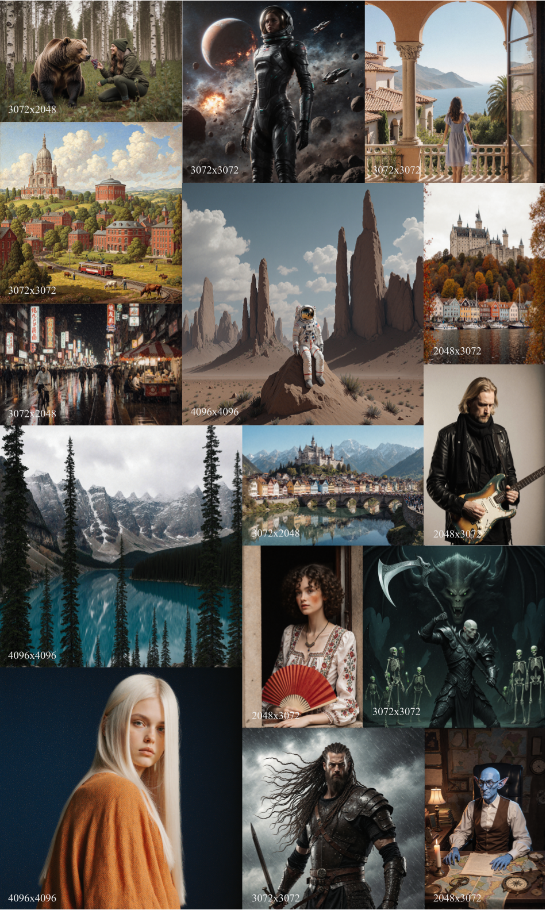

# DyPE: Dynamic Position Extrapolation for Ultra High Resolution Diffusion

<div align="center">

[](https://noamissachar.github.io/DyPE/)
[](https://arxiv.org/abs/2510.20766)

</div>

## (Cloned) Notes for myself

The model is gated, see [here](https://huggingface.co/black-forest-labs/FLUX.1-Krea-dev)

To set this up on Colab:

1. Open the terminal

2. Install miniconda
```bash
mkdir -p ~/miniconda3
wget https://repo.anaconda.com/miniconda/Miniconda3-latest-Linux-x86_64.sh -O ~/miniconda3/miniconda.sh
bash ~/miniconda3/miniconda.sh -b -u -p ~/miniconda3
rm ~/miniconda3/miniconda.sh
```

3. Clone the repo
```bash
git clone https://github.com/ManHinnn0509/DyPE.git
cd DyPE
```

4. Init conda, create venv and install dependencies
```bash
source ~/miniconda3/bin/activate
conda create -n dype python=3.10
conda activate dype
pip install -r requirements.txt

# missing in requirements.txt
pip install sqlalchemy
pip install protobuf
```

5. Run the script (if you want)
```bash
python run_dype.py --prompt "Your text prompt here"
```

Things I want to do:
- [ ] Add Gradio interface
- [ ] Use the uncensored version of the model used in this repo (?)

## TL;DR

**DyPE (Dynamic Position Extrapolation) enables pre-trained diffusion transformers to generate ultra-high-resolution images far beyond their training scale.** It dynamically adjusts positional encodings during denoising to match evolving frequency content—achieving faithful 4K × 4K results without retraining or extra sampling cost.

<div align="center">
  
</div>

## Installation

Create a conda environment and install dependencies:

```bash
conda create -n dype python=3.10
conda activate dype
pip install -r requirements.txt
```

## Usage

Generate ultra-high resolution images with DyPE using the `run_dype.py` script:

```bash
python run_dype.py --prompt "Your text prompt here"
```

**Key Arguments:**

| Argument | Default | Description |
|----------|---------|-------------|
| `--prompt` | Dark fantasy scene | Text prompt for image generation |
| `--height` | 4096 | Image height in pixels |
| `--width` | 4096 | Image width in pixels |
| `--steps` | 28 | Number of inference steps |
| `--seed` | 42 | Random seed for reproducibility |
| `--method` | `yarn` | Position encoding method: `yarn`, `ntk`, or `base` |
| `--no_dype` | False | Disable DyPE (enabled by default) |

**Examples:**

```bash
# Generate 4K image with default settings (YARN + DyPE)
python run_dype.py --prompt "A serene mountain landscape at sunset"

# Use NTK method without DyPE
python run_dype.py --method ntk --no_dype --prompt "A futuristic city skyline"

# Baseline comparison (no position encoding modifications)
python run_dype.py --method base
```

Generated images will be saved to the `outputs/` folder (created automatically).

## License and Commercial Use

This work is patent pending. For commercial use or licensing inquiries, please contact the [authors](mailto:noam.issachar@mail.huji.ac.il).

## Citation

If you find this useful for your research, please cite the following:

```bibtex
@misc{issachar2025dypedynamicpositionextrapolation,
      title={DyPE: Dynamic Position Extrapolation for Ultra High Resolution Diffusion}, 
      author={Noam Issachar and Guy Yariv and Sagie Benaim and Yossi Adi and Dani Lischinski and Raanan Fattal},
      year={2025},
      eprint={2510.20766},
      archivePrefix={arXiv},
      primaryClass={cs.CV},
      url={https://arxiv.org/abs/2510.20766}, 
}
```
